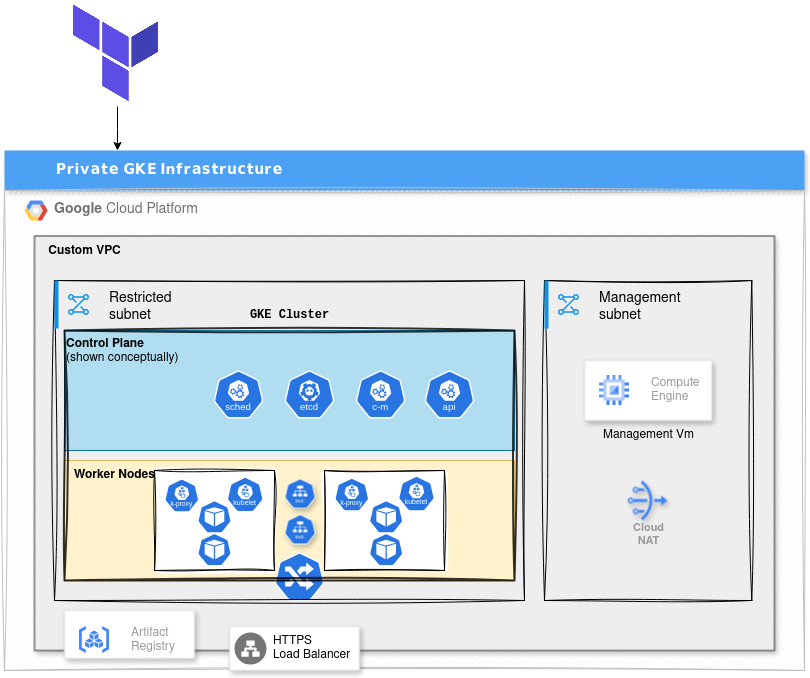

# 🔐 GCP Private GKE Infrastructure with Terraform & Demo App

## 📦 Infrastructure Overview

- 🌐 **Custom VPC** with two isolated subnets:
  - **Management Subnet**: Hosts a private compute VM used as a bastion for secure cluster access.
  - **Restricted Subnet**: Hosts the **private GKE cluster** with no external IPs.
- 🔁 **Cloud NAT Gateway**: Enables controlled egress access for private resources without exposing them to the internet.
- 💻 **Private Compute Engine VM**: Used for internal management, GKE access, and kubectl operations via IAP tunneling.
- ☸️ **Private Google Kubernetes Engine (GKE) Cluster**: Deployed in the restricted subnet with no public control or node IPs.
- 🔐 **Custom GKE Node Service Account**: Follows the principle of least privilege with only required IAM roles (logging, monitoring, artifact access).
- 🐳 **Artifact Registry**: Securely stores container images for the app and Redis.
- 🌍 **HTTP Load Balancer via Kubernetes Ingress**: Exposes the app to the internet while keeping internal components private.
- 🐍 **Python Demo App + Redis Backend**: Deployed as Kubernetes workloads in the private cluster.

---

## 📊 Architecture Diagram

